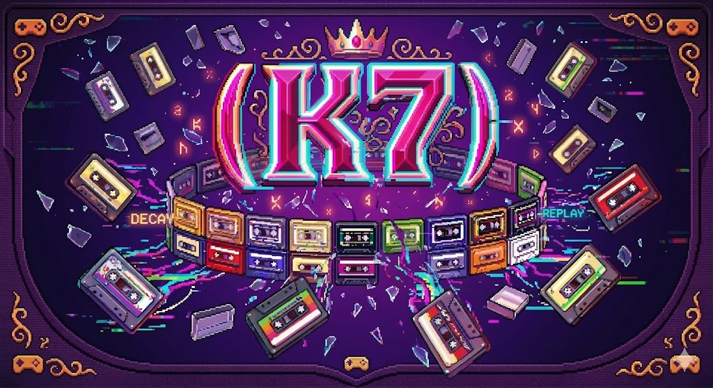

<div align="center">
  
</div>

# K7 Fantasy Console

A fantasy console that runs games as **WebAssembly** (Wasmtime on native, browser for web) or **Python in the browser** (Pyodide). Display via [pixels](https://github.com/parasyte/pixels) (native) or Canvas 2D (web); audio uses **Survie-inspired** melody notation and a Rust synth in `crates/k7/src/audio/` (see [Audio](#audio) below).

**Highlights**: 256×256 display, 16-color palettes (pico8, gameboy, cga, …), sprites + tilemap with flip/rotate flags, fonts (pico8, bbc, appleii, cbmii, trollmini), note-based sound + music tracks, WebSocket multiplayer (room-based), **LLM** (OpenAI-compatible API via same server), **keyboard capture** (text input mode for chat/typing), replay/record with GIF export, shareable game URLs and room links.

---

## Quick start (install and run)

### Prerequisites

- **[Rust](https://rustup.rs/)** — `cargo` and `rustc` on your `PATH`.
- **Web editor** — **[wasm-pack](https://rustwasm.github.io/wasm-pack/installer/)** (`cargo install wasm-pack`, or your OS package manager).
- **Native desktop game** (optional) — add the WASM target once:  
  `rustup target add wasm32-unknown-unknown`

### Web editor (fastest way to try K7)

From the **repository root**:

```bash
./scripts/run-dev.sh
```

This builds the `k7-web` WASM package, serves `crates/k7-web` on **http://localhost:8080**, and starts the multiplayer / LLM WebSocket server on port **8081**. Open **http://localhost:8080/editor.html**, focus the game canvas if needed, then click **Run**. Use the demo dropdown to load examples (Graffiti, Sable, Sprite-stack forest, and others).

**Editor-only** (no WebSocket server — multiplayer / LLM demos will not connect until you run the server separately):

```bash
cd crates/k7-web
wasm-pack build --target web --out-dir pkg
python3 -m http.server 8080
```

Then open **http://localhost:8080/editor.html**.

### Native runner (WASM game in a desktop window)

```bash
cargo build -p k7-game-example --target wasm32-unknown-unknown --release
cargo run -p k7-native -- target/wasm32-unknown-unknown/release/k7_game_example.wasm
```

Omit the `.wasm` path to open an empty window. More detail (sharing games, pause/audio, multiplayer) is in **[Usage](#usage)** below.

---

## Architecture (high level)

```
┌─────────────────────────────────────────────────────────────────────────────────┐
│                              K7 FANTASY CONSOLE                                   │
├─────────────────────────────────────────────────────────────────────────────────┤
│  crates/k7 (core)                                                                  │
│  ┌─────────────┐ ┌──────────┐ ┌────────┐ ┌───────┐ ┌───────┐ ┌──────────────┐   │
│  │ Display     │ │ Palette  │ │ Sprites│ │ Map   │ │ Fonts │ │ Audio        │   │
│  │ 256×256     │ │ 16 cols  │ │ 256×8×8│ │256×32 │ │ pico8 │ │ Engine +     │   │
│  │ 8b + RGBA   │ │ pico8…   │ │ bank   │ │ cells │ │ bbc…  │ │ note parser  │   │
│  └──────┬──────┘ └────┬─────┘ └───┬────┘ └───┬───┘ └───────┘ └──────┬───────┘   │
│         │             │            │           │                      │           │
│         └─────────────┴────────────┴───────────┴──────────────────────┘           │
│                                         │                                          │
│                                    Screen (single owner)                           │
└─────────────────────────────────────────┬─────────────────────────────────────────┘
                                          │
          ┌───────────────────────────────┼───────────────────────────────┐
          │                               │                                 │
          ▼                               ▼                                 ▼
┌─────────────────────┐     ┌─────────────────────────────┐     ┌─────────────────────┐
│  k7-native          │     │  k7-web (WASM)               │     │  k7-game-example    │
│  ─────────          │     │  ─────────────               │     │  ───────────────    │
│  • pixels + winit   │     │  • Canvas 2D                 │     │  • Builds to WASM    │
│  • wasmtime (game   │     │  • Web Audio API             │     │  • init/update/draw  │
│    WASM)            │     │  • WebSocket                 │     │  • Plasma, scroller │
│  • cpal (audio)     │     │  • K7Web → draw_to_canvas,   │     │    chiptune          │
│  • ws stub          │     │    set_sound, sfx, btn…      │     └─────────────────────┘
└─────────────────────┘     └──────────────┬───────────────┘
                                          │
                                          │  editor.html
                                          ▼
                              ┌─────────────────────────────┐
                              │  Pyodide + Ace editor        │
                              │  • Python: init/update/draw   │
                              │  • js.k7 = GFX, input, sound │
                              │  • Tabs: Code, GFX, Sounds,  │
                              │    Sprites, Map               │
                              │  • Share URL = full state    │
                              └─────────────────────────────┘
```

---

## Data flow (web / Python)

```
  ┌──────────────┐     runPythonAsync()      ┌─────────────────────┐
  │  Ace editor  │ ────────────────────────► │  Python game code    │
  │  (code)      │                            │  init() update()      │
  └──────────────┘                            │  draw()              │
         │                                    │  k7 = js.k7          │
         │                                    └──────────┬──────────┘
         │                                               │
         │  getCode()                                    │ k7.cls(), k7.pset(),
         │  setValue()                                   │ k7.sfx(), k7.btn()…
         ▼                                               ▼
  ┌──────────────┐     requestAnimationFrame   ┌─────────────────────┐
  │  Run / Pause │ ◄───────────────────────── │  game_loop_js()     │
  │  Hot reload  │     clearBtnp(), flash      │  (each frame)        │
  └──────────────┘     applyPausedOverlay      └──────────┬──────────┘
                                                           │
         ┌──────────────────────────────────────────────────┘
         │
         ▼
  ┌──────────────────────────────────────────────────────────────────┐
  │  K7Web (WASM)                                                     │
  │  • screen.pixel_buffer → draw_to_canvas("k7canvas")               │
  │  • soundBank[], sfxChains[] → set_sound, play_sfx_chain           │
  │  • btnState, btnpState, mouseX/Y → btn(), btnp(), mouse_x/y()     │
  │  • get_map(), get_sprite_sheet(), set_map(), set_sprite_sheet()   │
  └──────────────────────────────────────────────────────────────────┘
         │
         ▼
  ┌──────────────┐  ┌──────────────┐  ┌──────────────┐
  │ #k7canvas    │  │ Web Audio    │  │ WebSocket    │
  │ (256×256)    │  │ masterGain   │  │ ws_send/     │
  │ scaled 512px│  │ sfx/music    │  │ ws_take_msgs │
  └──────────────┘  └──────────────┘  └──────────────┘
```

---

## Technical details

### How K7 works (native vs web, backends)

**Native (desktop)** runs a single window and executes the game as **WebAssembly** inside the same process:

| Layer | Technology | Role |
|-------|------------|------|
| **Window & input** | [winit](https://github.com/rust-windowing/winit) | Event loop, window creation, resize, keyboard (F3 = FPS), mouse (cursor position scaled to 0..255; resizing rescales last position so coordinates stay valid). |
| **Rendering** | [pixels](https://github.com/parasyte/pixels) | 256×256 RGBA buffer; **wgpu** (Vulkan/Metal/DX12) presents to the window. Game draws via `cls`/`pset`/`pset_rgba`/`rectfill`/`rectfill_rgba` into the K7 `Screen` buffer; each frame the host copies `screen.pixel_buffer` into the pixels buffer and calls `pixels.render()`. |
| **Game runtime** | [wasmtime](https://github.com/bytecodealliance/wasmtime) | Loads the game WASM, calls exported `init` once then `update` and `draw` every frame. The host binds the K7 API in the `env` namespace (`cls`, `pset`, `print`, `mouse_x`, `rnd`, `play_music`, etc.) so the game runs no_std and talks only to the host. |
| **Audio** | [cpal](https://github.com/RustAudio/cpal) | System audio device; K7 `AudioEngine` (note parser, synth, effects) fills the stream buffer each callback. |

**Web (browser)** runs in the page and can drive either a **WASM game** or **Python (Pyodide)**:

| Layer | Technology | Role |
|-------|------------|------|
| **Build** | [wasm-pack](https://rustwasm.github.io/wasm-pack/) (`--target web`) | Produces `k7_web.js` + WASM; no native window, no wasmtime. |
| **Display** | **Canvas 2D** | K7 `Screen.pixel_buffer` (RGBA) is drawn with `ImageData` / `putImageData` onto a 256×256 canvas (often CSS-scaled). |
| **Input** | DOM events | Keyboard and mouse on the canvas; `btn`/`btnp`, `mouse_x`/`mouse_y`; optional text capture for chat. |
| **Audio** | **Web Audio API** | K7 synth runs in Rust (or JS fallback); `AudioContext`, gain nodes, playback of sounds and music tracks. |
| **Python** | [Pyodide](https://pyodide.org/) | In `editor.html`, Python code runs in the same page; `js.k7` exposes the same GFX/input/sound API so games can be written in Python and share URLs. |

**Performance (native)**: Fewer host calls help (e.g. `rectfill_rgba` instead of many `pset_rgba`). FPS overlay: **F3**. Mouse coordinates are corrected on window resize by rescaling the last known position to the new size.

### Core (crates/k7)

| Component   | Details |
|------------|---------|
| **Display** | 256×256 pixels (default), 8-bit palette (16 colors) + 32-bit RGBA API (`pset_rgba`, `print_rgba`). Palettes: **pico8**, **gameboy**, **cga**, **commodore64**, **atari2600** (`switch_palette`, `palette_list`). Clipping, camera, `cls`, `pset`, `rect`, `rectfill`, `circ`, `circfill`, `line`, `print`, `spr`, `map_draw`, `flash`. |
| **Sprites** | Single bank of **256** sprites, each **8×8** pixels (palette index). Sheet = 256×64 pixels. `sget`/`sset` for sheet; `spr(n,x,y,w,h,flip_x,flip_y,scale?)` to draw (scale 1 = 8px, 2 = 16px per tile). |
| **Map**     | **256×32** cells (8-bit = sprite index) + **tile flags** per cell. `mget`/`mset`; `mget_flags`/`mset_flags(cx,cy,f)` — bits 1=flip_x, 2=flip_y, 4=rotate 90° CW; `map_draw(cx,cy, sx,sy, w,h)` draws tiles with flags. |
| **Fonts**   | Predefined: **pico8**, **bbc**, **appleii**, **cbmii**, **trollmini**. `set_font(name)`, `print`, `print_rgba`. |
| **Audio**   | Note-based notation (survie-style). 4 channels, 64 definable sounds, 8 music tracks. Waveforms, instruments, effects (reverb, echo, envelope, etc.). |

### Native (crates/k7-native)

- **Window**: [pixels](https://github.com/parasyte/pixels) + [winit](https://github.com/rust-windowing/winit).
- **Game**: Loads a **WASM** binary (e.g. from `k7-game-example`), calls exported `init`/`update`/`draw` each frame; host implements K7 API via `wasmtime` linker.
- **Audio**: [cpal](https://github.com/RustAudio/cpal).
- **WebSocket**: Host bindings stubbed; inbox ready for a real client.

### Web (crates/k7-web)

- **Build**: `wasm-pack build --target web` → `pkg/k7_web.js` + WASM.
- **Display**: `draw_to_canvas(canvas_id)` copies `screen.pixel_buffer` (RGBA) to Canvas 2D.
- **Input**: Keyboard (btn/btnp 0–7), mouse (mouse_x, mouse_y, mouse_btn, mouse_btnp) on game canvas. **Text input mode**: `text_input_mode(True)` captures typed characters, Enter, and Backspace into a queue; `take_key_queue()` returns and clears them (for chat, prompts, etc.). When enabled, those keys do not trigger btn/btnp.
- **Audio**: Web Audio API; `render_sound(notation)` (Rust synth) or JS fallback. 16 sound slots, 8 music tracks, `master_volume`, `mute_sfx`/`mute_music`. SFX chains (4 chains) for simple melodies.
- **Multiplayer**: WebSocket; `ws_connect`, `ws_send`, `ws_take_messages`, `ws_connected`. Server: room-based matchmaking (create/join by code).
- **LLM**: Via WebSocket server; client sends `LLM_REQ:{json}`, server POSTs to `http://127.0.0.1:1234/v1/chat/completions` and replies `LLM_RESP:content` or `LLM_ERR:message`. Use `ws_connect`, then `llm_send`; poll `llm_take_response()` each frame.

### Python in browser (editor.html)

- **Runtime**: [Pyodide](https://pyodide.org/) loads once; user code runs in `runPythonAsync(getCode())`. **Run** resets VM state (`reset_game_state`: palette, map, sprites, camera, clip).
- **Layout**: Editor (code + tabs) on the left, game canvas on the right; **canvas-only** toggle (arrow button) hides the editor for fullscreen play.
- **Loop**: `requestAnimationFrame` → `game_loop_js()` → `clearBtnp()`, flash overlay, pause overlay. **Pause (P)** stops the game loop and **pauses background music** (no new notes, gain muted); **Resume** restores music and loop.
- **State**: Code (Ace), 16 sound slots, 4 SFX chains, sprite sheet, map live in JS; K7Web holds display/map/sprites in WASM. **Share URL**: full state (code, sounds, chains, map, sprites) encoded in hash `#g=<base64>`; on load, decode and restore. **Text input mode**: when a game calls `text_input_mode(True)`, the editor captures typed characters (and Enter/Backspace) into a queue; the game reads them with `take_key_queue()` (e.g. LLM chat demo).

---

## Usage

All commands from the **repository root** (`K7/`).

### Native (run game WASM)

```bash
cargo build -p k7-game-example --target wasm32-unknown-unknown --release
cargo run -p k7-native -- target/wasm32-unknown-unknown/release/k7_game_example.wasm
```

Without a path, the window opens with an empty screen.

### Web (Python in browser)

```bash
cd crates/k7-web
wasm-pack build --target web
python3 -m http.server 8080
# Open http://localhost:8080/editor.html  (editor)
# Open http://localhost:8080/  (player: loads game from ?g= only; no editing)
```

- **index.html**: Player-only page. With `?g=<base64>` in the URL it redirects to the editor in player mode (game runs, no editor UI). With no `g=` it shows a message and link to the editor.
- **editor.html**: Full editor. **Layout**: code and tabs on the left, game canvas on the right; **canvas-only** button (◀/▶) hides the editor. **Tabs**: Code, Graphics, Sounds, Sprites, Map.
- **Run**: Executes the code, resets VM state (palette, map, sprites), and starts the game loop. **Pause** (or **P**) toggles pause; when paused, the game loop and **background music** are both paused (music resumes on Resume or on next Run).
- **Examples**: Default, Showcase (90s demoscene), Mouse, Multiplayer, Shared drawing, Plasma, Fonts, RGBA, Ski, Flappy, Fireworks, Flock, Ghostmark (benchmark, Z/X = dots), Snake, Sprites, Map scroll, Tilemap flags, Palettes, Pong, Breakout, Platformer, Rave Tunnel, Kaleidoscope, Hypno Spiral, Raster Bars, Scroller, **Phrack** (terminal/CFP style), Fire, Audio test, **LLM demo**, Sequencer, Sable (falling sand).
- **Share**: **Share game** builds a URL that encodes code, 16 sound slots, 4 SFX chains, map, and sprite sheet. State is compressed (deflate) when supported for shorter URLs; legacy uncompressed base64 is still supported when opening old links.
- **Fixed timestep**: The game loop runs at 60 FPS (fixed step); multiple steps per display frame can run to catch up, capped to avoid spiral of death.
- **Audio**: Web Audio is resumed on first key or click (wrap/canvas) so games can play sound without browser autoplay limits. Music and SFX pause with the game when **Pause** is used.
- **Replay**: **Record** captures input and video frames; **Stop** ends recording; **Play** replays input; **Export GIF** downloads the recording as an animated GIF (video only; uses local `deps/gifshot.min.js`); **Import** loads input replay from JSON.

### Share URL (full game in one link)

1. Click **Share game** in the Code tab.
2. The URL is updated to `...editor.html?g=<encoded>` and copied to the clipboard. Share that link.
3. Opening that URL in the **editor** restores state and you click **Run** to play. Opening it via **index.html** (or editor.html?g=...&player=1) runs the game immediately with no editor UI.

State format: when the value after `g=` starts with **z**, it is base64 of deflate-compressed JSON. Otherwise it is legacy base64 of raw JSON. JSON fields: `code`, `sounds` (array of 16 strings), `chains` (array of 4 arrays of `{slot, delay}`), `map` (base64 of 256×32 bytes), `sprites` (base64 of 256×64 bytes).

### Multiplayer & LLM (WebSocket server)

1. Start server: `cargo run -p k7-multiplayer-server` (default `ws://localhost:8081`). Or use the helper scripts: `./scripts/run-server.sh` (multiplayer only, dev), `./scripts/run-server.sh --release` (release). To run **both** the Python HTTP server (port 8080, for loading the editor) and the multiplayer server (port 8081) together: `./scripts/run-dev.sh` (or `./scripts/run-dev.sh --release`). Then open http://localhost:8080/editor.html.
2. **Multiplayer**: In editor.html, choose **Multiplayer** example, then **Create room** or **Join room** (code), then **Run**. Each client in the same room sends/receives messages.
3. **LLM**: Same server proxies LLM requests to `http://127.0.0.1:1234` (OpenAI-compatible). In code: `k7.ws_connect("ws://127.0.0.1:8081")`, then `k7.llm_send(prompt)`. Run an API on port 1234 (e.g. Ollama + proxy, LiteLLM).
4. **Room links**: After creating or joining a room, use **Copy room link** to get a URL with `?room=CODE`. Opening that URL pre-fills the join code so others can join with one click.

---

## Audio

K7’s audio stack lives in **`crates/k7`** (`AudioEngine`, `note_parser`, `synth`). It follows **token-based melody** strings similar in spirit to the Survie tracker: notes, optional waveforms, pipe-separated effects, and **`note:category:preset`** shortcuts that expand to layered waveforms plus effects.

### Capacities (core vs web editor)

| Topic | **Rust core** (`k7`) | **Web editor** (`editor.html` / `k7-web`) |
|-------|----------------------|-------------------------------------------|
| **Polyphony / mix** | **4** playback channels | Same idea for music steps; SFX mixed in Web Audio |
| **Sound definitions** | **64** slots (`SOUND_COUNT`) | **16** slots in the UI (`set_sound(0..15, …)`, share URL stores 16) |
| **Music tracks** | **8** (`set_music_track` / `play_music` in host bindings) | **8** tracks in the editor |
| **SFX chains** | — | **4** chains of delayed slot plays (`play_sfx_chain(0..3)`) |

Native / cartridge code can use the full **64** sound bank where the host exposes it; Python examples in the editor use **0–15** so they match the on-page sound editor.

### Notation (quick reference)

- **Notes**: `c4`, `d#4`, rests `-` or `r`.
- **Per-note volume**: `c4@80` (0–100, scaled to linear gain) — parsed in **Rust** (`parse_token`) and in the **web** `parseSoundToken`.
- **Per-note length**: Prefix letters `w`/`h`/`q`/`e`/`s`/`t` (whole … thirty-second) before the octave, e.g. `cq4`; or a beat count after the note in the first segment, e.g. `c4:0.5:sine` — see `parse_note_str_and_short_duration` / `parse_token` in `note_parser.rs`.
- **Waveform on a note**: `c4:sine`, `c4:square`, `c4:triangle`, `c4:sawtooth`, `c4:noise`, `c4:pink`, `pwm:0.25`, or **`layer:sine:0.4,tri:0.3,sq:0.1`** (blended layers). Layered waveforms are synthesized in Rust (`generate_layered`).
- **Effects** (examples; full list in `Effect::from_str`): `reverb:small|…`, `echo:medium`, `tremolo` / `trem`, `vibrato` / `vib`, `chorus`, `phaser`, `flanger`, `lowpass` / `lp`, `highpass` / `hp`, `distortion` / `dist`, `bitcrush`, `compressor` / `comp`, `limiter`, `delay`, `ringmod`, **`envelope:pluck`** (and other envelope presets or numeric ADSR), **`arp:maj`** / **`arpeggio`**, **`port`** / **`portamento`** (slide is applied when a positive target frequency is set; the default parsed target is often `0`, so many single-token patterns are a no-op for portamento), **`autopan`**, **`sidechain`**, **`eq`**.
- **Instrument shortcut**: `c4:piano:bright`, `e4:bass:punch`, `g4:drums:kick`, etc. — expanded by `expand_sound_token` into waveform + effect tokens (large preset table in `note_parser.rs`).

Playback runs note events through waveform generation (including **layered** mixes), then **`apply_note_effects`** (envelope, arpeggio, filters, dynamics, and the rest). The **web** runtime can use the **Rust** synth via WASM or a **JS fallback** path for some tokens; both accept the same string syntax for editor games.

### Relation to Survie

K7 reuses the **idea** of compact music-DSP strings and many of the same effect names, implemented in its own engine (no Bevy dependency). It is **not** a byte-for-byte match to another project’s preset count or internal `ARCHITECTURE.md`; treat Survie as **inspiration**. For the source of truth on what K7 actually parses and applies, see **`crates/k7/src/audio/note_parser.rs`** and **`crates/k7/src/audio/mod.rs`**.

---

## Game API (web Python)

Via `k7 = js.k7`:

- **GFX**: `cls`, `pset`, `pset_rgba`, `rect`, `rectfill`, `circ`, `circfill`, `line`, `print`, `print_rgba`, `color`, `camera`, `clip`, `draw_to_canvas("k7canvas")`, `flash(color, frames)`.
- **Sprites & map**: `spr(n, x, y, w, h, flip_x, flip_y, scale?)` (scale optional, default 1; 2 = 16×16 for one 8×8 tile), `sget`/`sset`, `mget`/`mset`, `mget_flags`/`mset_flags(cx,cy,f)`, `map_draw`.
- **Input**: `btn(i)`, `btnp(i)` (0–7); `mouse_x()`, `mouse_y()`, `mouse_btn(i)`, `mouse_btnp(i)`. **Keyboard capture (text input)**: `text_input_mode(True)` to enable, `text_input_mode(False)` to disable. `take_key_queue()` returns a list of captured characters (each `"\n"` for Enter, `"\b"` for Backspace, or a one-character string); call each frame and process in a loop (e.g. for in-game chat or prompts).

### Keyboard input (web editor)

Click the game canvas (or game area) to focus it so key events are captured. Button indices and keys:

| `btn(i)` / `btnp(i)` | Index | Keys |
|----------------------|-------|------|
| Left                 | 0     | **←** (Arrow Left), **A** |
| Right                | 1     | **→** (Arrow Right), **D** |
| Up                   | 2     | **↑** (Arrow Up), **W** |
| Down                 | 3     | **↓** (Arrow Down), **S** |
| Action (O)           | 4     | **Z** |
| Action (X)           | 5     | **X** |
|                      | 6     | **C** |
|                      | 7     | **V** |

**Mouse**: `mouse_x()`, `mouse_y()` (0–255 over the canvas); `mouse_btn(0)` = left button held, `mouse_btnp(0)` = left just pressed; `mouse_btn(1)` / `mouse_btnp(1)` = right button.

**Text input (keyboard capture)**  
For chat, prompts, or any typed input inside the game: call `k7.text_input_mode(True)` (e.g. in `init()`). Then each frame call `for c in k7.take_key_queue():` and handle `c`: `"\n"` = Enter, `"\b"` = Backspace, else one character. Call `k7.text_input_mode(False)` when done. When enabled, those keys are not reported as btn/btnp.

**Editor**: **P** = Pause / Resume game (pauses game loop and background music).
- **Sound**: `set_sound(id, notation)`, `sfx(id)`, `play_sfx_chain(id)`, `set_music_track`, `play_music`, `stop_music`, `master_volume`, `mute_sfx`/`mute_music`.
- **Palette / flash**: `palette_swap(a,b)`, `flash(color, frames)`, `switch_palette(name)` (pico8, gameboy, cga, commodore64, atari2600), `palette_list()`.
- **Map flags**: `mget_flags(cx,cy)`, `mset_flags(cx,cy,f)` — bits 1=flip_x, 2=flip_y, 4=rotate; used by `map_draw`.
- **Multiplayer**: `ws_connect(url)`, `ws_send(msg)`, `ws_take_messages()`, `ws_connected()`.
- **LLM (via WebSocket server)**: Connect with `ws_connect("ws://127.0.0.1:8081")` (same server as multiplayer). Then `llm_configure(..., model?)`, `llm_send(prompt, system_prompt?)`, `llm_pending()`, `llm_take_response()`, `llm_take_error()`. Server proxies to `http://127.0.0.1:1234` (e.g. Ollama + proxy, LiteLLM).
- **Pause**: `paused()` (1/0), `toggle_pause()`.
- **Frame clock**: `frame()` — returns the current frame number (incremented each game loop tick). Use for timing, animations, or simulations that need “at most once per frame” updates (e.g. falling sand).
- **Text input**: `text_input_mode(on)` — enable (True/1) or disable (False/0) keyboard capture. `take_key_queue()` — returns list of `"\n"`, `"\b"`, or 1-char strings; clears the queue. Use for in-game chat (e.g. LLM demo) or any text field.

See in-app **Cheat sheet** for the full list.

---

## Demo ideas: super awesome games & multiplayer

Ideas for standout single-player demos and multiplayer games that fit the current K7 API (GFX, sprites, sound, WebSocket rooms).

### Single-player demos

- **Tiny RPG** – Top-down overworld, simple combat (HP, attack/defend), NPCs, inventory as a small menu. Uses `map_draw`, sprites, `btn`/`btnp`, and `k7.frame()` for timers. Great to show off map + sprites + state.
- **Twin-stick shooter** – Left stick = move, right = aim/shoot (mouse or keys). Waves of enemies, power-ups, screen shake and particles. Showcases `mouse_x`/`mouse_y`, `spr` with scale, `flash`, sound.
- **Roguelike dungeon** – Grid movement, fog of war (draw only visible tiles), items, simple AI. Demonstrates map, `mget`/`mset`, and procedural layout.
- **Rhythm / music game** – Notes fall in lanes; hit on beat. Uses `k7.frame()` for sync and `sfx`/`play_sfx_chain` for feedback. Can be single-player only and still feel “super awesome”.
- **Tower defense** – Path on map, towers with range/attack, waves of units. Good mix of map, sprites, and simple AI.

### Multiplayer demos (WebSocket + rooms)

Current setup: `cargo run -p k7-multiplayer-server`, then Create/Join room; all messages in a room are broadcast. Protocol is up to the game (e.g. short text like `x,y` or `pos:128,100|action:shoot`).

- **Multiplayer Pong / Breakout** – 2 players: one paddle each, or shared bricks and each has a paddle. Sync ball and paddle positions every frame (or a few times per second) via `ws_send` / `ws_take_messages`. Simple protocol: `p,x,y` for paddle, `b,x,y,vx,vy` for ball; host can be ball authority.
- **Co-op Breakout** – Same room, two paddles (e.g. left/right or bottom shared). One ball, shared score. Messages: paddle x, ball state (one client authoritative), score.
- **Last ship standing** – 2–4 players: each a small ship, move + shoot. Bullets and positions synced; first to N kills or last alive wins. Protocol: `pos,x,y,rot` and `shot,angle`; each client simulates and reconciles with incoming messages.
- **Shared drawing / graffiti** – Everyone in the room draws on the same 256×256; sync `pset` or small rects as messages. More “toy” than game but shows off real-time sync and is easy to extend (e.g. clear, colors).
- **Snake battle** – 2 players, each a snake; grow by eating dots; die on wall or other snake. Sync head positions and length; each client can simulate movement and validate with occasional state from host.
- **Bomberman-style** – Grid, place bombs, explosions. Sync grid state and player positions; simple protocol (e.g. `b,x,y` for bomb, `e,x,y` for explosion) so everyone stays in sync.

### What makes a demo “super awesome” on K7

- **Juice** – Screen shake, particles, `flash`, sound on hits and goals. Breakout already shows this.
- **Clear rules** – One simple mechanic (dodge, shoot, catch, match) so it’s obvious what to do.
- **Share link** – One click to Share game and send the link; the other player opens and hits Run. Same for multiplayer: share room code.
- **Short loop** – 30–60 second rounds or levels so people can replay and show others quickly.

If you want to implement one of these, a practical order is: **Multiplayer Pong** (reuse existing Pong + multiplayer position sync), then **Co-op Breakout** (reuse Breakout + two paddles + room), then a **twin-stick** or **tiny RPG** as a single-player flagship.

---

## Possible next improvements

Ideas for where K7 could go next, roughly by area:

**Core / API**
- (Tilemap flags and palettes gameboy/cga are already in; see Technical details.)

**Editor / web**
- **Export cartridge**: Save/load a single file (e.g. `.k7` or Pico-8–style text) that includes code, gfx, map, sprites, sounds, and restore it in the editor.
- **Touch / gamepad**: Map touch buttons or Gamepad API to `btn(0..7)` so games work well on mobile and with controllers.
**Native runner**
- **WebSocket**: Implement the TODOs in `wasm_host.rs` so native games can use `ws_connect` / `ws_send` / `ws_take_messages` like the web build.
- **Cartridge loading**: Let the native runner load a `.k7` (or similar) file so games can be run without recompiling WASM.

**Ecosystem / docs**
- **Example gallery**: A small “games” page that links to 3–5 finished K7 games (share URLs or hosted carts) to show what’s possible.
- **Short tutorial**: A “first game” walkthrough (move a sprite, add sound, share) in the README.
- **Pico-8 / Pikuseru compatibility**: Document or implement a subset of Pico-8/Pikuseru APIs (e.g. `spr` semantics, `__gfx__` import) to make porting easier.

**Polish**
- **Resizable canvas**: Allow 256×256 to be scaled (e.g. 2×, 3×, full-width) in the editor and player with pixel-perfect or smooth scaling.

---

## References

- [pikuseru](https://github.com/PikuseruConsole/pikuseru) – structure and cartridge format
- [pixels](https://github.com/parasyte/pixels) – hardware-accelerated pixel buffer
- [wasmtime](https://github.com/bytecodealliance/wasmtime) – WebAssembly runtime
- [Pyodide](https://pyodide.org/) – Python in the browser
